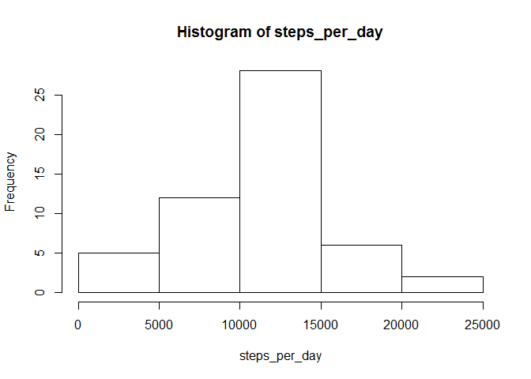
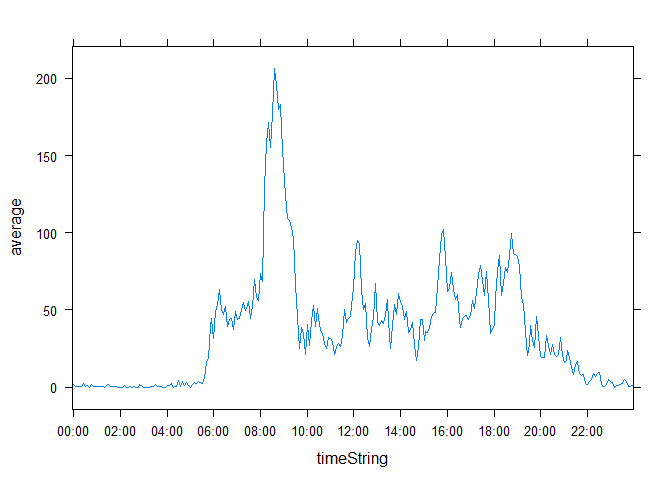
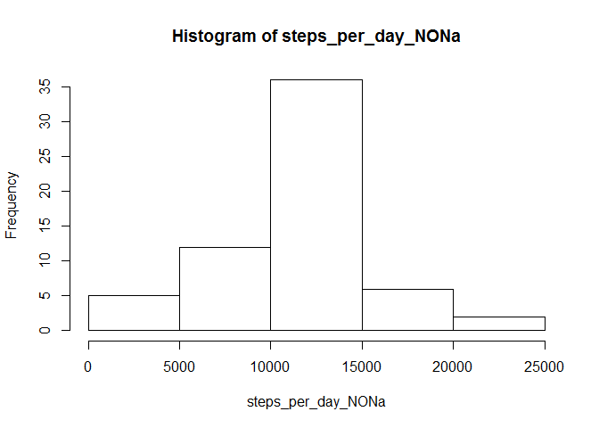
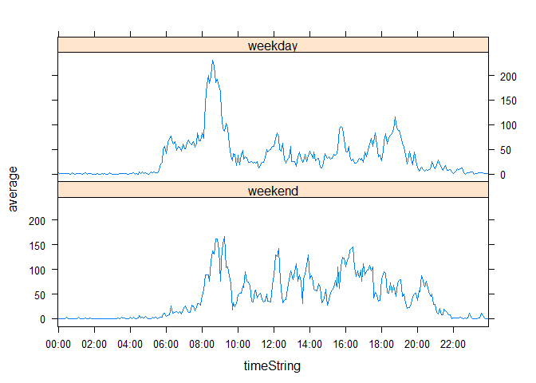

# Reproducible Research: Peer Assessment 1


## Loading and preprocessing the data

Show any code that is needed to

1. Load the data (i.e. read.csv())


```r
zipfile="activity.zip"
datafile="activity.csv"
data<-read.csv(unz(zipfile,datafile), stringsAsFactors=FALSE)
```

2. Process/transform the data (if necessary) into a format suitable for your analysis

```r
data$dateString<-data$date
data$date<-as.Date(data$date)
data$timeString<-paste(sprintf("%02d",floor(data$interval/100)),sprintf("%02d",data$interval-floor(data$interval/100)*100),sep=":")
data$timeString<-as.factor(data$timeString)
#data$fullDate<-as.POSIXct(paste(data$date,data$timeString))
```


## What is mean total number of steps taken per day?

For this part of the assignment, you can ignore the missing values in the dataset.

1. Calculate the total number of steps taken per day


```r
library(stats)
steps_per_day<-xtabs(steps~date, data=data)
steps_per_day
```

```
## date
## 2012-10-02 2012-10-03 2012-10-04 2012-10-05 2012-10-06 2012-10-07 
##        126      11352      12116      13294      15420      11015 
## 2012-10-09 2012-10-10 2012-10-11 2012-10-12 2012-10-13 2012-10-14 
##      12811       9900      10304      17382      12426      15098 
## 2012-10-15 2012-10-16 2012-10-17 2012-10-18 2012-10-19 2012-10-20 
##      10139      15084      13452      10056      11829      10395 
## 2012-10-21 2012-10-22 2012-10-23 2012-10-24 2012-10-25 2012-10-26 
##       8821      13460       8918       8355       2492       6778 
## 2012-10-27 2012-10-28 2012-10-29 2012-10-30 2012-10-31 2012-11-02 
##      10119      11458       5018       9819      15414      10600 
## 2012-11-03 2012-11-05 2012-11-06 2012-11-07 2012-11-08 2012-11-11 
##      10571      10439       8334      12883       3219      12608 
## 2012-11-12 2012-11-13 2012-11-15 2012-11-16 2012-11-17 2012-11-18 
##      10765       7336         41       5441      14339      15110 
## 2012-11-19 2012-11-20 2012-11-21 2012-11-22 2012-11-23 2012-11-24 
##       8841       4472      12787      20427      21194      14478 
## 2012-11-25 2012-11-26 2012-11-27 2012-11-28 2012-11-29 
##      11834      11162      13646      10183       7047
```

2. If you do not understand the difference between a histogram and a barplot, research the difference between them. Make a histogram of the total number of steps taken each day


```r
hist(steps_per_day)
```

 

3. Calculate and report the mean and median of the total number of steps taken per day


```r
mean_steps_per_day<-mean(steps_per_day)
median_steps_per_day<-median(steps_per_day)

options(scipen = 1, digits = 2)
```
mean of the total number of steps taken per day is 10766.19

median of the total number of steps taken per day is 10765


## What is the average daily activity pattern?

1. Make a time series plot (i.e. type = "l") of the 5-minute interval (x-axis) and the average number of steps taken, averaged across all days (y-axis)


```r
library(dplyr)
```

```
## 
## Attaching package: 'dplyr'
## 
## The following object is masked from 'package:stats':
## 
##     filter
## 
## The following objects are masked from 'package:base':
## 
##     intersect, setdiff, setequal, union
```

```r
time_serie<-data %>% select(steps,timeString) %>% group_by(timeString) %>% summarize(average=mean(steps, na.rm=TRUE))
library(lattice)
xyplot(average ~ timeString, time_serie, type="l", scales=list(x=list(at=seq(1,12*24,24))))
```

 

2. Which 5-minute interval, on average across all the days in the dataset, contains the maximum number of steps?


```r
time_serie[which.max(time_serie$average),]$timeString
```

```
## [1] 08:35
## 288 Levels: 00:00 00:05 00:10 00:15 00:20 00:25 00:30 00:35 00:40 ... 23:55
```

on average across all the days interval 08:35, contains the maximum number of steps


## Imputing missing values

Note that there are a number of days/intervals where there are missing values (coded as NA). The presence of missing days may introduce bias into some calculations or summaries of the data.

1. Calculate and report the total number of missing values in the dataset (i.e. the total number of rows with NAs)


```r
total_number_NA<-sum(is.na(data))
```

total number of missing values in the dataset is 2304

2. Devise a strategy for filling in all of the missing values in the dataset. The strategy does not need to be sophisticated. For example, you could use the mean/median for that day, or the mean for that 5-minute interval, etc.


Lets check where NA's are located.
1st let's separate all NAs and count them

```r
NAs<-data[is.na(data$steps),]
nrow(NAs)
```

```
## [1] 2304
```

then let's check on which dates NA's are located and how many there are unique dates with NAs 

```r
unique(NAs$date)
```

```
## [1] "2012-10-01" "2012-10-08" "2012-11-01" "2012-11-04" "2012-11-09"
## [6] "2012-11-10" "2012-11-14" "2012-11-30"
```

```r
length(unique(NAs$date))
```

```
## [1] 8
```

then let's check on which intervals NA's are located and how many there are unique intervals with NAs 


```r
unique(NAs$interval)
```

```
##   [1]    0    5   10   15   20   25   30   35   40   45   50   55  100  105
##  [15]  110  115  120  125  130  135  140  145  150  155  200  205  210  215
##  [29]  220  225  230  235  240  245  250  255  300  305  310  315  320  325
##  [43]  330  335  340  345  350  355  400  405  410  415  420  425  430  435
##  [57]  440  445  450  455  500  505  510  515  520  525  530  535  540  545
##  [71]  550  555  600  605  610  615  620  625  630  635  640  645  650  655
##  [85]  700  705  710  715  720  725  730  735  740  745  750  755  800  805
##  [99]  810  815  820  825  830  835  840  845  850  855  900  905  910  915
## [113]  920  925  930  935  940  945  950  955 1000 1005 1010 1015 1020 1025
## [127] 1030 1035 1040 1045 1050 1055 1100 1105 1110 1115 1120 1125 1130 1135
## [141] 1140 1145 1150 1155 1200 1205 1210 1215 1220 1225 1230 1235 1240 1245
## [155] 1250 1255 1300 1305 1310 1315 1320 1325 1330 1335 1340 1345 1350 1355
## [169] 1400 1405 1410 1415 1420 1425 1430 1435 1440 1445 1450 1455 1500 1505
## [183] 1510 1515 1520 1525 1530 1535 1540 1545 1550 1555 1600 1605 1610 1615
## [197] 1620 1625 1630 1635 1640 1645 1650 1655 1700 1705 1710 1715 1720 1725
## [211] 1730 1735 1740 1745 1750 1755 1800 1805 1810 1815 1820 1825 1830 1835
## [225] 1840 1845 1850 1855 1900 1905 1910 1915 1920 1925 1930 1935 1940 1945
## [239] 1950 1955 2000 2005 2010 2015 2020 2025 2030 2035 2040 2045 2050 2055
## [253] 2100 2105 2110 2115 2120 2125 2130 2135 2140 2145 2150 2155 2200 2205
## [267] 2210 2215 2220 2225 2230 2235 2240 2245 2250 2255 2300 2305 2310 2315
## [281] 2320 2325 2330 2335 2340 2345 2350 2355
```

```r
length(unique(NAs$interval))
```

```
## [1] 288
```

Number of unique dates with NAs 8 and unique intervals with NAs 288 shows us that NAs are located only on dates (on all intervals):
2012-10-01, 2012-10-08, 2012-11-01, 2012-11-04, 2012-11-09, 2012-11-10, 2012-11-14, 2012-11-30

So my strategy proposal for filling in all of the missing values in the dataset is mean grouped by every 5-minute interval (it's already calculated in time_serie variable).

3. Create a new dataset that is equal to the original dataset but with the missing data filled in.


```r
dataNONa<-data
dataNONa[is.na(dataNONa$steps),]$steps<-time_serie$average
```

4. Make a histogram of the total number of steps taken each day and Calculate and report the mean and median total number of steps taken per day. Do these values differ from the estimates from the first part of the assignment? What is the impact of imputing missing data on the estimates of the total daily number of steps?


```r
steps_per_day_NONa<-xtabs(steps~date, data=dataNONa)
steps_per_day_NONa
```

```
## date
## 2012-10-01 2012-10-02 2012-10-03 2012-10-04 2012-10-05 2012-10-06 
##      10766        126      11352      12116      13294      15420 
## 2012-10-07 2012-10-08 2012-10-09 2012-10-10 2012-10-11 2012-10-12 
##      11015      10766      12811       9900      10304      17382 
## 2012-10-13 2012-10-14 2012-10-15 2012-10-16 2012-10-17 2012-10-18 
##      12426      15098      10139      15084      13452      10056 
## 2012-10-19 2012-10-20 2012-10-21 2012-10-22 2012-10-23 2012-10-24 
##      11829      10395       8821      13460       8918       8355 
## 2012-10-25 2012-10-26 2012-10-27 2012-10-28 2012-10-29 2012-10-30 
##       2492       6778      10119      11458       5018       9819 
## 2012-10-31 2012-11-01 2012-11-02 2012-11-03 2012-11-04 2012-11-05 
##      15414      10766      10600      10571      10766      10439 
## 2012-11-06 2012-11-07 2012-11-08 2012-11-09 2012-11-10 2012-11-11 
##       8334      12883       3219      10766      10766      12608 
## 2012-11-12 2012-11-13 2012-11-14 2012-11-15 2012-11-16 2012-11-17 
##      10765       7336      10766         41       5441      14339 
## 2012-11-18 2012-11-19 2012-11-20 2012-11-21 2012-11-22 2012-11-23 
##      15110       8841       4472      12787      20427      21194 
## 2012-11-24 2012-11-25 2012-11-26 2012-11-27 2012-11-28 2012-11-29 
##      14478      11834      11162      13646      10183       7047 
## 2012-11-30 
##      10766
```

```r
hist(steps_per_day_NONa)
```

 

```r
mean_steps_per_day_NONa<-mean(steps_per_day_NONa)
median_steps_per_day_NONa<-median(steps_per_day_NONa)
```

mean of the total number of steps taken per day is 10766.19 (in the 1st part of assignment it was: 10766.19)

median of the total number of steps taken per day is 10766.19 (in the 1st part of assignment it was: 10765)

So we can see that impact is very low


## Are there differences in activity patterns between weekdays and weekends?

For this part the weekdays() function may be of some help here. Use the dataset with the filled-in missing values for this part.

1. Create a new factor variable in the dataset with two levels – “weekday” and “weekend” indicating whether a given date is a weekday or weekend day.


```r
#i prefer not to use weekdays() function as it shows weekdays names in local language. So using this as solution on computer with different Locale could generate errors. Instead of tht I'm using isWeekday() from "timeDate" package 
library(timeDate)
```

```
## Warning: package 'timeDate' was built under R version 3.2.1
```

```r
dataNONa$wDay<-factor(isWeekday(data$date), labels=c("weekend","weekday"))
```

2. Make a panel plot containing a time series plot (i.e. type = "l") of the 5-minute interval (x-axis) and the average number of steps taken, averaged across all weekday days or weekend days (y-axis). See the README file in the GitHub repository to see an example of what this plot should look like using simulated data.


```r
time_serie_wD<-dataNONa %>% select(steps,timeString,wDay) %>% group_by(wDay, timeString) %>% summarize(average=mean(steps, na.rm=TRUE))

xyplot(average ~ timeString|wDay, time_serie_wD, type="l", scales=list(x=list(at=seq(1,12*24,24))), layout=c(1,2))
```

 
